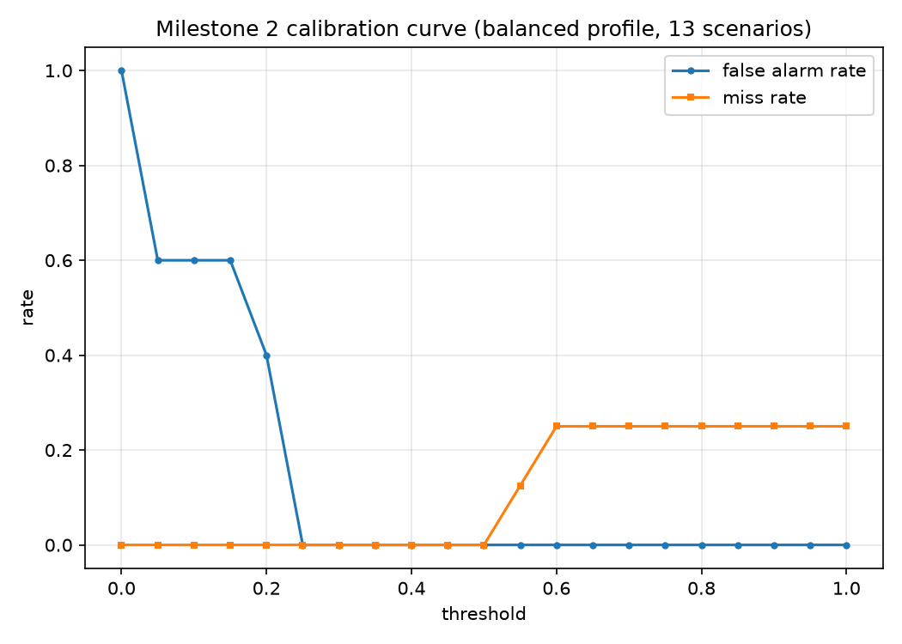

# Milestone 2 calibration curve (balanced profile, 13 scenarios)

Scenarios: 13 | Threshold points: 21

| threshold | false_alarm_rate | miss_rate | accuracy | TP | TN | FA | miss |
|---|---|---|---|---|---|---|---|
| 0.00 | 100% | 0% | 62% | 8 | 0 | 5 | 0 |
| 0.05 | 60% | 0% | 77% | 8 | 2 | 3 | 0 |
| 0.10 | 60% | 0% | 77% | 8 | 2 | 3 | 0 |
| 0.15 | 60% | 0% | 77% | 8 | 2 | 3 | 0 |
| 0.20 | 40% | 0% | 85% | 8 | 3 | 2 | 0 |
| 0.25 | 0% | 0% | 100% | 8 | 5 | 0 | 0 |
| 0.30 | 0% | 0% | 100% | 8 | 5 | 0 | 0 |
| 0.35 | 0% | 0% | 100% | 8 | 5 | 0 | 0 |
| 0.40 | 0% | 0% | 100% | 8 | 5 | 0 | 0 |
| 0.45 | 0% | 0% | 100% | 8 | 5 | 0 | 0 |
| 0.50 | 0% | 0% | 100% | 8 | 5 | 0 | 0 |
| 0.55 | 0% | 12% | 92% | 7 | 5 | 0 | 1 |
| 0.60 | 0% | 25% | 85% | 6 | 5 | 0 | 2 |
| 0.65 | 0% | 25% | 85% | 6 | 5 | 0 | 2 |
| 0.70 | 0% | 25% | 85% | 6 | 5 | 0 | 2 |
| 0.75 | 0% | 25% | 85% | 6 | 5 | 0 | 2 |
| 0.80 | 0% | 25% | 85% | 6 | 5 | 0 | 2 |
| 0.85 | 0% | 25% | 85% | 6 | 5 | 0 | 2 |
| 0.90 | 0% | 25% | 85% | 6 | 5 | 0 | 2 |
| 0.95 | 0% | 25% | 85% | 6 | 5 | 0 | 2 |
| 1.00 | 0% | 25% | 85% | 6 | 5 | 0 | 2 |
