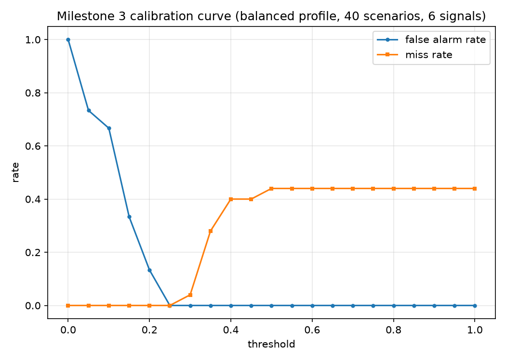

# Milestone 3 calibration curve (balanced profile, 40 scenarios, 6 signals)

Scenarios: 40 | Threshold points: 21

| threshold | false_alarm_rate | miss_rate | accuracy | TP | TN | FA | miss |
|---|---|---|---|---|---|---|---|
| 0.00 | 100% | 0% | 62% | 25 | 0 | 15 | 0 |
| 0.05 | 73% | 0% | 72% | 25 | 4 | 11 | 0 |
| 0.10 | 67% | 0% | 75% | 25 | 5 | 10 | 0 |
| 0.15 | 33% | 0% | 88% | 25 | 10 | 5 | 0 |
| 0.20 | 13% | 0% | 95% | 25 | 13 | 2 | 0 |
| 0.25 | 0% | 0% | 100% | 25 | 15 | 0 | 0 |
| 0.30 | 0% | 4% | 98% | 24 | 15 | 0 | 1 |
| 0.35 | 0% | 28% | 82% | 18 | 15 | 0 | 7 |
| 0.40 | 0% | 40% | 75% | 15 | 15 | 0 | 10 |
| 0.45 | 0% | 40% | 75% | 15 | 15 | 0 | 10 |
| 0.50 | 0% | 44% | 72% | 14 | 15 | 0 | 11 |
| 0.55 | 0% | 44% | 72% | 14 | 15 | 0 | 11 |
| 0.60 | 0% | 44% | 72% | 14 | 15 | 0 | 11 |
| 0.65 | 0% | 44% | 72% | 14 | 15 | 0 | 11 |
| 0.70 | 0% | 44% | 72% | 14 | 15 | 0 | 11 |
| 0.75 | 0% | 44% | 72% | 14 | 15 | 0 | 11 |
| 0.80 | 0% | 44% | 72% | 14 | 15 | 0 | 11 |
| 0.85 | 0% | 44% | 72% | 14 | 15 | 0 | 11 |
| 0.90 | 0% | 44% | 72% | 14 | 15 | 0 | 11 |
| 0.95 | 0% | 44% | 72% | 14 | 15 | 0 | 11 |
| 1.00 | 0% | 44% | 72% | 14 | 15 | 0 | 11 |
